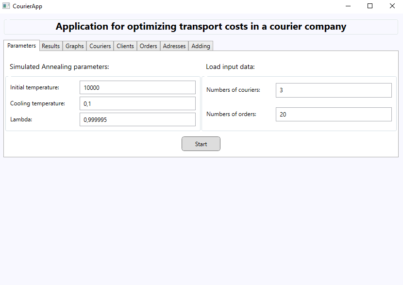
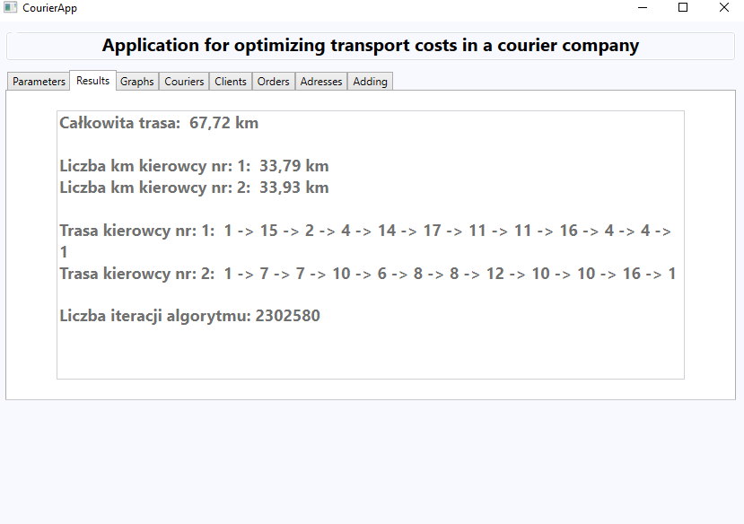
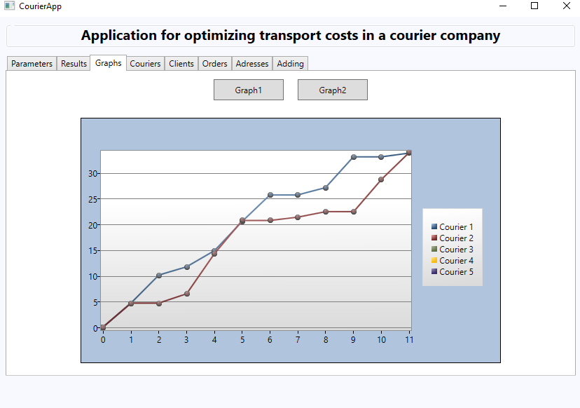
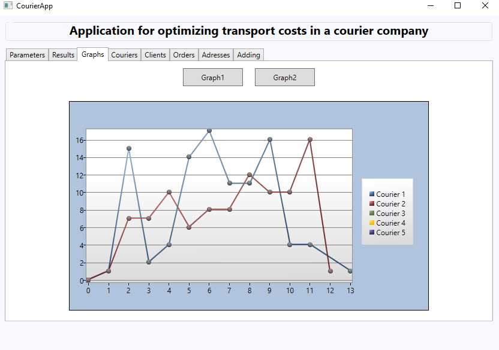
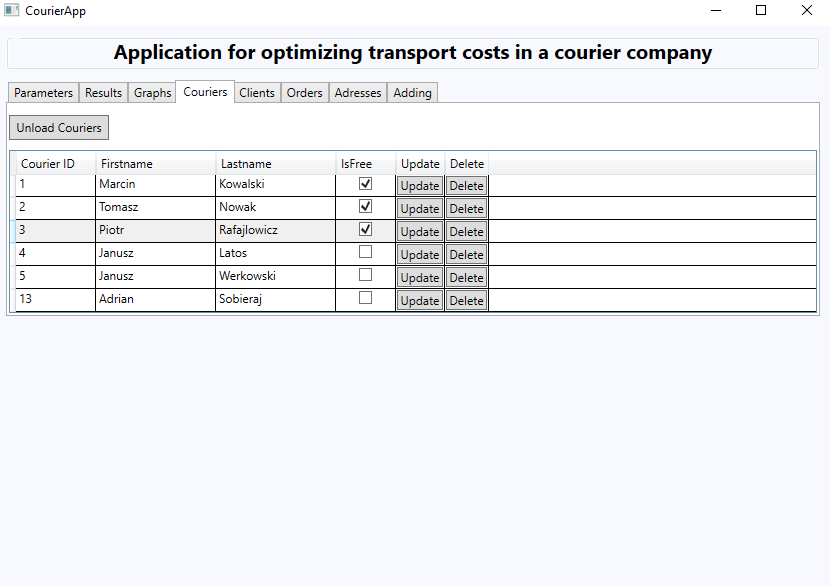
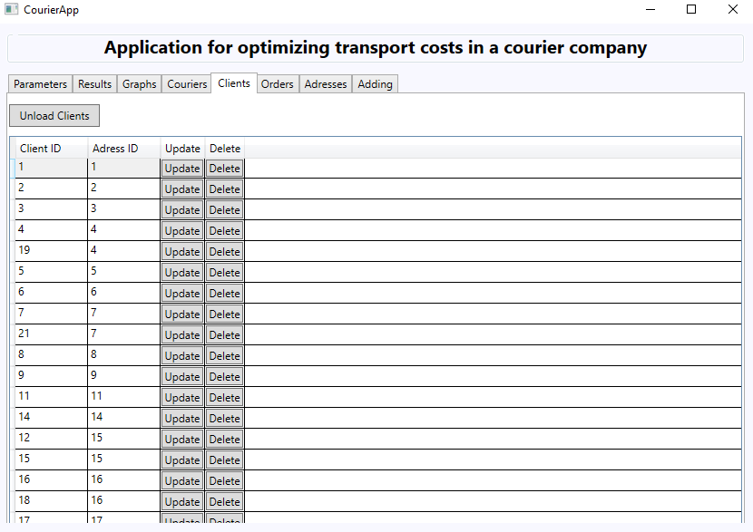
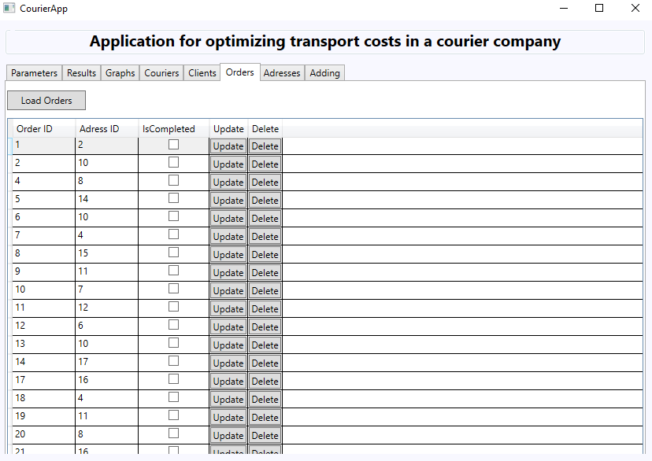
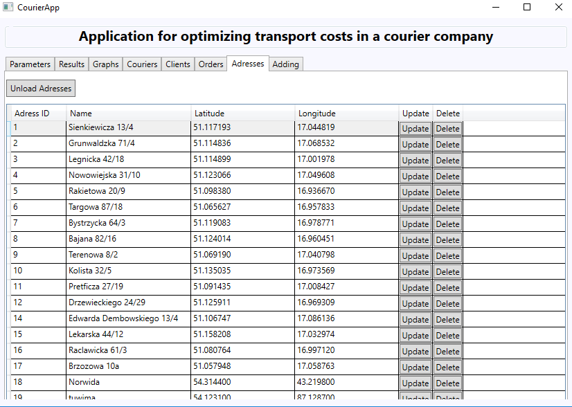
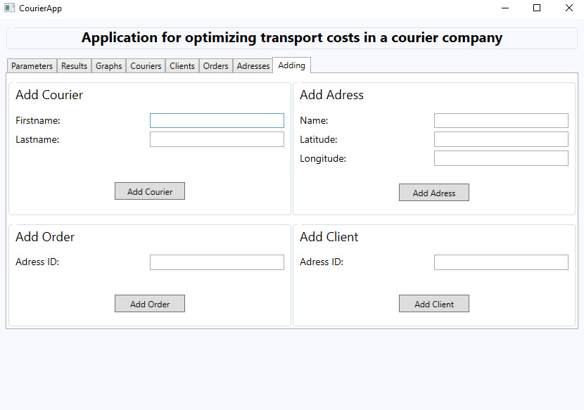

# courier-WPF
Application for optimizing transport costs in a courier company

## Table of contents
* [General info](#general-info)
* [Main technologies](#technologies)
* [Screenshots](#screenshots)
* [Features](#features)
* [Inspiration](#inspiration)
* [Contact](#contact)

## General info
Transport cost optimization system in a courier company. Desktop application that allows to manage couriers, customers, orders and distribute orders between couriers to minimize their working time. The distances between adresses are calculated using geographical coordinates. Algorithm that calculates the shortest route is simulated annealing.

## Main technologies
* .NET Core - version 3.1
* C# - version 8.0
* EntityFramework Core - version 3.1.2
* SQL Server

## Screenshots

## Features
List of features ready:
* setting parameters of SA Algorithm and count of couriers and orders
* calculating of shortest route for each of couriers using SA Algorithm (asynchronously) and showing the results
* visualization of SA algorithm results using graphs
* browsing and modifying the courier/client/order/adress table
* adding new courier/client/order/adress

## Inspiration
Project was created for the needs of the course - optimization of discrete production processes.

## Contact
Created by [@adrian0808](https://github.com/adrian0808)
